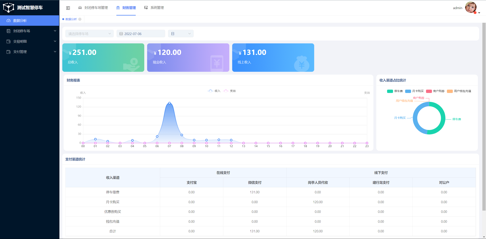
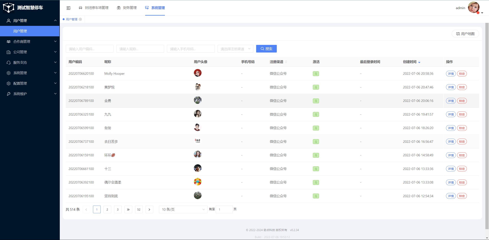

# 智慧停车云平台_停车收费_物联网

本停车管理平台基于Spring Cloud Hoxton & Alibaba、 OAuth2 的RBAC 权限管理系统。采用六边形架构解耦业务逻辑和具体技术实现，全面贯彻领域驱动设计，聚焦核心业务，无论是学习还是商用，十年内不会过时。
我们团队已有多年城市级停车系统开发经验，本系统为最新重构研发，进行了充分市场调研和采用最新技术架构，欢迎大家一起交流和学习，联系电话（同微信）：15927051130。

### 功能介绍
支持本地盒子和纯云端双模式，本地盒子在云端无效时候依然进行业务处理，在云端重新连接后即时同步双方数据。纯云端模式只需在相机配置上云端接口地址，即可快速接入到云平台开始运营。
兼容市面上主流的相机，底层已做抽象，根据需要可以快速接入其它品牌相机。
支持月卡、内部车、免费车功能，通过灵活的配置支持广泛的收费策略配置。支持商家管理和发券。更多正在全力开发中，敬请期待...

系统机构层级为合作商-公司-停车场；经过调研，公司下面可能还有物业单位，目前以纳入开发进度。

1. 硬件管理
云端添加停车场后，本地盒子连接网络后激活后会自动连接到云端，可实时显示盒子连接状态。

2. 停车场管理
可添加停车场、岗亭、通道。可分别配置临停车和内部车收费策略；经过充分调研各个停车场的收费策略需求后，设计出通用的策略模型和计算逻辑，满足广泛的收费策略要求。

3. 停车记录管理
详细记录产生时间，地点，进出口位置，进出时间，异常数据实时推送与快速处理

4. 支付渠道管理
每个停车场的支付账号均可以独立配置，支持同一个停车场使用多家支付机构进行支付，例如支付宝，微信，银联等。

5. 支付与优惠活动管理
本系统线上支付支持支付宝与微信支付，目前均为服务商模式。在系统已有支付方式支持外，每个公司还可以单独配置自己需要的线下收入渠道。
合作商可以配置自己的支付方式，合作商下面公司可以添加自己的支付渠道及配置支付参数。

6. 财务管理
多维度统计财务收支情况，方便管理人员查看经验状况。

7. 商家管理
每个公司可以添加自己的商家，商家可以通过小程序购买停车券发给自己的顾客。

### 软件架构
采用阿里巴巴微服务框架进行实现微服务提供能力，追求高性能，高可用，超细粒度独立微服务，相同服务可以动态灵活增加与减少，支持不停机发布新版本服务。
每个服务之间均为独立存在，充分解耦，除了用于停车业务系统，可作为中台用于各类平台中间件；例如用户系统、授权管理、系统管理、短信发送，支付，订单，停车场系统接口，停车场后台管理，停车场提供者服务等均为独立的服务。

#### 开发语言

1. 服务端
服务端语言目前均采用java语言开发，jdk版本要求1.8+。开发框架为Spring cloud Alibaba，鉴权采用spring cloud security oauth2，DB操作框架Jpa，数据通讯采用MQTT。

2. 客户端
目前客户端分为三个场景，用户端采用小程序和H5，商家端采用小程序UniApp，公司以及合作商管理端采用Android flutter框架。

3. 后台管理
后台管理前端框架采用的是主流的vue element admin，分层清晰，官方文档完整，社区活跃

#### 数据存储
1. 重要数据存储
重要数据均采用mysql进行存储，支持部署主从，大部分数据尽可能进行事务处理，确保数据容灾性

2. 缓存数据存储
对于经常使用的数据如停车场、通道等会缓存于Redis，避免频繁请求。

#### 性能与安全
1. 性能解决方案
架构与技术解决方案均为本团队一线10年开发经验总结，系统已经全面经过Jmeter压力测试，20亿数据毫无压力。

2. 安全解决方案
所有请求均需携带jwt串token进行访问，每个接口服务和管理服务均需配置公钥文件且具有jwt串token合法性校验能力，用户权限服务携带私钥文件负责密钥生成。

